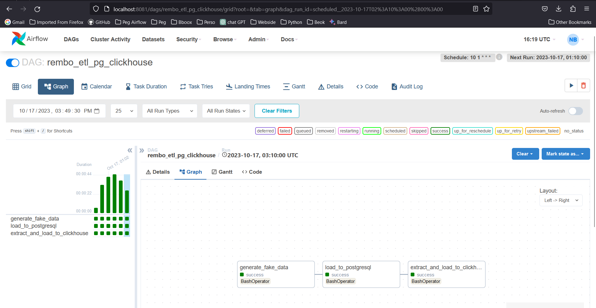

# Rembo-Project-Assigment

## Setting up the environment

### Requirements
    * Python >=3.8
    * virtualenv

1. Clone the repository
    Using SSH:
    ```bash
    git clone git@github.com:Sopho-Ngak/Rembo-Project-Assigment.git && cd Rembo-Project-Assigment
    ```
    or using HTTPS:
    ```bash
    git clone https://github.com/Sopho-Ngak/Rembo-Project-Assigment.git && cd Rembo-Project-Assigment
    ```
2. install virtualenv if not installed
    ```bash
    pip install virtualenv
    ```
    or python3-env
    ```bash
    sudo apt install python3-venv
    ```
3. Create a virtual environment
    ```bash
    virtualenv env
    ```
    or using python3-env
    ```bash
    python3 -m venv env
    ```
4. Activate the virtual environment
    ```bash
    source env/bin/activate
    ```
5. Install the requirements
    ```bash
    pip install -r requirements.txt
    ```
6. Run the application
    * Using the command line
    * LIST_COMMANDS bellow
    - generate_fake_data
    - load_to_postgresql
    - extract_and_load_to_clickhouse
    
    ```bash
    python main.py -c generate_fake_data
    ```
    ```bash
    python main.py -c load_to_postgresql
    ```
    ```bash
    python main.py -c extract_and_load_to_clickhouse
    ```

7. Run airflow jobs
* open two terminal windows
* in the first terminal window run the airflow webserver
    ```bash
    airflow webserver
    ```
* in the second terminal window run the airflow scheduler
    ```bash
    airflow scheduler
    ```
* open your browser and go to http://localhost:8081

8. Open another terminal windowns and run this command to create airflow user
    ```bash
    airflow users create \
        --username youre_username \
        --firstname your_first_name \
        --lastname your_last_name \
        --role Admin \
        --email your_rando,_email
    ```


    


